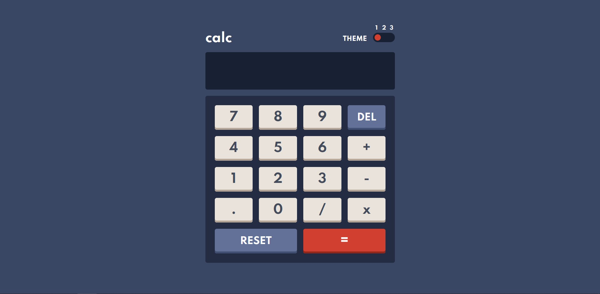

# Frontend Mentor - Calculator app solution

This is a solution to the [Calculator app challenge on Frontend Mentor](https://www.frontendmentor.io/challenges/calculator-app-9lteq5N29). Frontend Mentor challenges help you improve your coding skills by building realistic projects. 

## Table of contents

- [Overview](#overview)
  - [The challenge](#the-challenge)
  - [Screenshot](#screenshot)
  - [Links](#links)
- [My process](#my-process)
  - [Built with](#built-with)
  - [What I learned](#what-i-learned)
  - [Useful resources](#useful-resources)
- [Author](#author)

## Overview

### The challenge

Users should be able to:

- See the size of the elements adjust based on their device's screen size
- Perform mathmatical operations like addition, subtraction, multiplication, and division
- Adjust the color theme based on their preference
- **Bonus**: Have their initial theme preference checked using `prefers-color-scheme` and have any additional changes saved in the browser

### Screenshot

### Links

- Solution URL: [Add solution URL here](https://your-solution-url.com)
- Live Site URL: https://paiput.github.io/calculator-app/

## My process

### Built with

- Semantic HTML5 markup
- [CSS Modules](https://github.com/css-modules/css-modules) 
- CSS custom properties
- CSS Grid
- [React](https://reactjs.org/) - JS library

### What I learned

I learned a little bit about css modules. I would say that for a simple project like this one css modules are not necessary and it may would be better to simply use css.

### Useful resources

- [CSS Modules Documentation](https://github.com/css-modules/css-modules) - Official CSS Modules Documentation. It's quite simple. 

## Author

- Website - 
- Frontend Mentor - [@paiput](https://www.frontendmentor.io/profile/paiput)
- Twitter - [@paiput_](https://www.twitter.com/paiput_)
